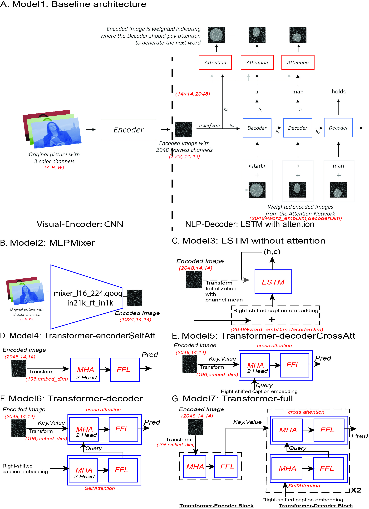

## Image Captioning

Image Captioning is the process of generating textual descriptions of an
image. The most common deep-learning-based solutions address this task with a visual-encoder/NLP-decoder architecture. In this project, we explored different visual-encoder and NLP-decoder structures, and test their performances on COCO2014 datasets. To make our models comparable, in the baseline architecture (Model1), We used RESNET101 for the visual-encoder, and LSTM for the NLP-decoder with attention mechanisms. This baseline model have a bleu4=0.3372 in the evaluation dataset in our best-trained model.

For the visual-encoder module, in recent years, several non-CNN-based structures such as MLPMixer and ViT, which also show good performance in computer vision tasks. We applied MLPMixer as an alternative visual-encoder (Model2), and it showed competing performance with the baseline architecture based on its bleu4=0.2996.

For the NLP-decoder module, we first tested the performance without attention mechanisms(Model3, bleu4=0.3388). Then, we applied transformers. A transformer includes a sub-encoder and a sub-decoder part. We implemented different transformer structures, including 1. transformer with only the sub-encoder part, which includes only the self-attention (Model4,bleu4=0.1399); 2. transformer with only the sub-decoder cross attention part (Model6,bleu4=0.3187); 3. transformer with only the sub-decoder part (Model6,bleu4=0.3210); 4. transformer with both sub-encoder and sub-decoder parts (Model7,bleu4=0.3307).



**Acknowledgements:** 

* Thanks [sgrvinod](https://github.com/sgrvinod/a-PyTorch-Tutorial-to-Image-Captioning)'s code as a foundation of our code.
* Thanks [RoyalSkye](https://github.com/RoyalSkye/Image-Caption/tree/e528b36b32fdc8175921ce60bb9a2c6cecafebb8) for the transformer code. and README template.

### Section 1: Run

#### 1.1 Dataset

Images: We are using the **MSCOCO'14** Dataset: [Training (13GB)](http://images.cocodataset.org/zips/train2014.zip), [Validation (6GB)](http://images.cocodataset.org/zips/val2014.zip), and [Testing (6GB)](http://images.cocodataset.org/zips/test2014.zip)

Caption: We are using [Andrej Karpathy's training, validation, and test splits](http://cs.stanford.edu/people/karpathy/deepimagesent/caption_datasets.zip).

#### 1.2 Environment Set Up

We are using Python 3.10,torch==1.13.1 and torchvision==0.14.1.

Create environment using **environment.yaml**
Conda environment tutorial(https://docs.conda.io/projects/conda/en/latest/user-guide/tasks/manage-environments.html)
```shell
conda env create -f environment.yaml
```

#### 1.3 Modules

**create_input_files.py**

Before training, you should run this module to generate required data files. (10 files)

> * TEST/TRAIN/VAL_CAPLENS_X.json: the length of each caption.
>* TEST/TRAIN/VAL_CAPTIONS_X.json: all captions of images.
> * TEST/TRAIN/VAL_IMAGES_X.hdf5: image data, stored in hdf5 format.
>* WORDMAP_X.json: A dictionarty that converts words into id.

Parameters:

>* --dataset: which dataset we used, either 'coco', 'flickr8k' or 'flickr30k'.
>* --karpathy_json_path: path of captions dataset.
>* --image_folder: path of image dataset.
>* --captions_per_image: how many captions each image has?
>* --min_word_freq: the frequency of words less than it will be <unk>.
>* --output_folder: output file path.
>* --max_len: the maximum length of each caption.

**train.py**

In this module, you can easily check or modify the parameters you wish to. You can train your model from scratch, or resume training at a checkpoint by point to the corresponding file with the checkpoint parameter. It will also perform validation at the end of every training epoch.

 This module has too many parameters, so we only introduce parts of them.

You can modify model parameters to change the structure of the network. In our implementation, there are two attention methods: `ByPixel` and `ByChannel`, and two decoder modes: `lstm` and `transformer`. Training parameters are used to control the hyperparameters of learning such as learning rate and batch size. "alpha_c" is the weight assigned to the second loss, and checkpoint is the path of the previous model. All parameters are shown in below table.

|      **Type**       | **Parameters**                                                                                                                                                                                                   |
| :-----------------: | ---------------------------------------------------------------------------------------------------------------------------------------------------------------------------------------------------------------- |
| Dataset parameters  | -data_folder; --data_name;                                                                                                                                                                                       |
|  Model parameters   | --emb_dim; --attention_dim; --decoder_dim; --n_heads; </br>--dropout;  --decoder_mode; --attention_method; </br>--encoder_layers; --decoder_layers;                                                              |
| Training parameters | --epochs; --stop_criteria; --batch_size; --print_freq; </br>--workers; --encoder_lr; --decoder_lr; --grad_clip; </br>--alpha_c; --checkpoint; --fine_tune_encoder;</br> --fine_tune_embedding; --embedding_path; |

**datasets.py**

A PyTorch Dataset class to be used in a PyTorch DataLoader to create batches.

**models.XXXX.py**

The PyTorch neural network class of different architectures, including encoders and decoders. 

**training.py**
Training codes for different models with config files


**eval.py**

Evaluating the trained model by generating the caption based on Beam Search given a searchsize (=5).  


**caption.py**

Read an image and caption it with beam search. The output of this module is a generated caption and the visualization of attention.


**utils.py**

This module consists of some useful functions, such as save checkpoints, write log files, update learning rates, log training matrix. Those functions are called many times. To keep the code clean, we move them into this module.

#### 1.4 Run
To run, make sure we have the right directory in create_input_files.py, train.py, eval.py, and caption.py.

##### 1.4.1 create input files

In create_input_files.py, set 'karpathy_json_path' and other parameters, which should be consistent with the config_modelX.yaml files used in the configs folder.

```python
    create_input_files(dataset='coco',
                       karpathy_json_path='data/caption_datasets/dataset_coco.json',
                       image_folder='/home/xxx/data',
                       captions_per_image=5,
                       min_word_freq=5,
                       output_folder='/home/xxx/output',
                       max_len=50)
```

Then, we will create the input files.

```shell
$ python create_input_files.py
```

##### 1.4.2 Training
In the configs folder, edit the hyperparameters in the corresponding model config files, the 'data_folder' should be the same as 'output_folder' in 1.4.1.

```shell
#example for model1
$ python training.py --config configs/config_model1.yaml
```


If we want to resume training from a checkpoint, you could change it in the training settings:
```yaml
checkpoint: BEST_checkpoint_model_2_coco_5_cap_per_img_5_min_word_freq.pth.tar
```

If we want to tune the pretrained encoders, in this case, you might need to reduce the 'batch_size' as much more gradient parameters are in the memory:

```yaml
fine_tune_encoder: True # fine-tune encoder?
```

Additionally, you could also change the model structures, such as # of headers and # of transformer-decoder layers during model constructions in training.py.


##### 1.4.3 Evaluation

During training and validation steps, we simply get the words with the highest prob at each position. At the evaluation step with test set, we apply Beam Search to get top sentences.
We could evaluate based on our best model or based on our most recent trained model by setting 'checkpoint_eval' at the config_modelX.yaml file

The 'beam_size_eval' for the beam search could also be set there.

```shell
#example for model1
$ python eval.py --config configs/config_model1.yaml
```

##### 1.4.4 Caption
after specifying 'img' in the config file, we could get captions with attentions based your best model or most recent model

```shell
#example for model1
$ python caption.py --config configs/config_model1.yaml
```

### Section 2: Discussion

There is not too much difference between Model1 and Model3, suggesting that positional information in COCO2014 might not be that important given our evaluation matrix. This is because, in Model3, we only used the average value of each feature channel as the initial value for the hidden state of LSTM cells and the positional values were not used. We argue that if we really want to show the advantages of attention mechanism in this case, we might need image-caption set where captions are more related to the positional information. Still, you get what you trained on your training set.

There are a lot of other elements worth trying,such as:

1. Adding a pretrained word embeddings. Our current embeddings are learned from scratch. A well pretrained word embedding model might be helpful. Even better, if we could apply some Vision-language pretraining models.

2. Using ViT in the visual-encoder part, as we mentioned in the introduction part, some others get better results using ViT based models ( For example, the ViLBERT model by Lu et al.  and the OSCAR model by Li et
al.).

3. Other tricks such as Multi-model learning, such as Kim et al. uses cross-modal skip-connections between a vision encoder and NLP-decoder.

**Other Contributors (alphabetically):**  Quan Qi, Kun Yu, Runfeng Zhang
